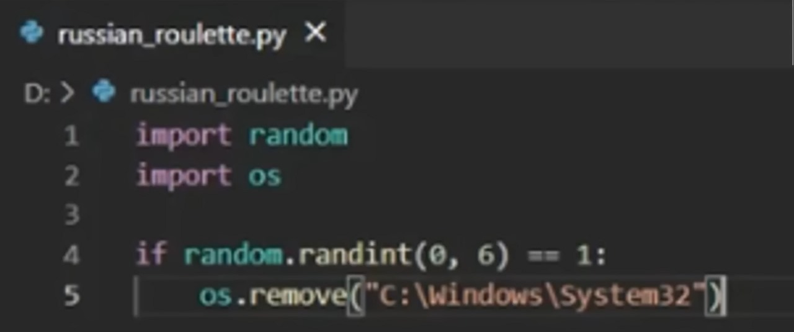

# RussianRoulettePy

Have you ever been so bored that you wouldn't mind losing some files? Check this repo!

So, I was so bored with nothing to do, then saw the next image.

At first, I laughed. Then, the intrusive ideas came in and... well, here we are.

## Getting Started
I'm not sure. I did it in the rush. I used [Python 3.12](https://www.python.org/downloads/), I don't know if it works on older versions.
Oh, and it probably just works on Windows for now.

## Install
### Clone this project
```
git clone https://github.com/Benjas333/RussianRoulettePy
cd RussianRoulettePy
```
Or just download the f*cking [RussianRoulettePy.py](https://github.com/Benjas333/RussianRoulettePy/blob/main/RussianRoulettePy.py) file, dude.
### Install Send2Trash (Optional):
Requires [Send2Trash](https://pypi.org/project/Send2Trash/) for 'practice' arg.
```
pip install Send2Trash
```
I promise I didn't copy the format from other repo 🗿.

## Usage
### Import
Import and that's all my buddy. Nothing complicated.
```python
# Import script
from RussianRoulettePy import RussianRoulettePy

fun = RussianRoulettePy() # Initializes object. Has the same args than the command line
fun.play() # Starts playing
```
### Command line
You can also run the script using cmd.
```
python RussianRoulettePy.py [-h] [-m MODE] [-f FOLDERS] [-b BULLETS] [-p PRACTICE]
```
|Option|Desc| Default|
|----|---|---|
|-m, --mode| Define the game mode. |"normal"|
|-f, --folders| Define the directories where files will be chosen from.|['Documents', 'Downloads', 'Music', 'Pictures', 'Videos', 'Desktop']|
|-b, --b | Define the amount of bullets... lol. | 6 |
|-p, --p| If True, files will be moved to the Recycle bin instead of being removed. Except for 'baby' and 'extreme' modes. REQUIRES Send2Trash module instaled.| False|
### Game Over
Just type "exit".
## Features
- Various game `mode`(s):

|Mode  | Description| Can practice? (arg) |
|------|--------------|-------------|
|normal | Normal game mode, random file removed when a shoot is executed. | **Yes**
|baby | It just doesn't remove files, but prints what file would have been removed. For babies. | **No** (unnecessary)
|realtime | Similar to normal mode, but files are targeted each round (so you'd know what you could lose before pulling the trigger). | **Yes**
|suicide | Targets the script file. | **Yes**
|extreme | Targets System32 (MUST run the script with root privileges). | Why would I move System32 to the Recycle bin?

- Especify the targeting `folders`.
- Change amount of `bullets`.
- `practice` arg (make files get moved to the Recycle Bin instead of getting eliminated. **Requires** [Send2Trash](https://pypi.org/project/Send2Trash/)).
- Score and highscore system :D

### WIP
- Even more game modes:

|Mode  | Description|
|------|--------------|
|hard | Instead of targeting files, targets whole parent directory of random files.
|hardrt | Hard mode realtime; i.e., directories are targeted each round before pulling the trigger.
|apps | Would remove application directories from 'Program Files' and 'Program Files (x86)' instead of 'folders' arg.
|executables | Would remove .exe files from the computer, variation of 'apps' mode.
- Maybe add global score using env variables.
- Maybe add basePath as an arg, instead of being a const. That would be interesting.
- GUI Program (just to visualize the files you're gonna lose before losing them LMAO).
- Some day I'll make this shit a videogame (probably wouldn't use Python).
- Rn it works with a while loop and inputs. But, for the GUI and the videogame it probably has to be an iterable object, so I had to add that.

## Contributing
Idk. If you want so.

## License
Idk. This code is trash. Credits to the meme author who inspíred me to do this 🗿.